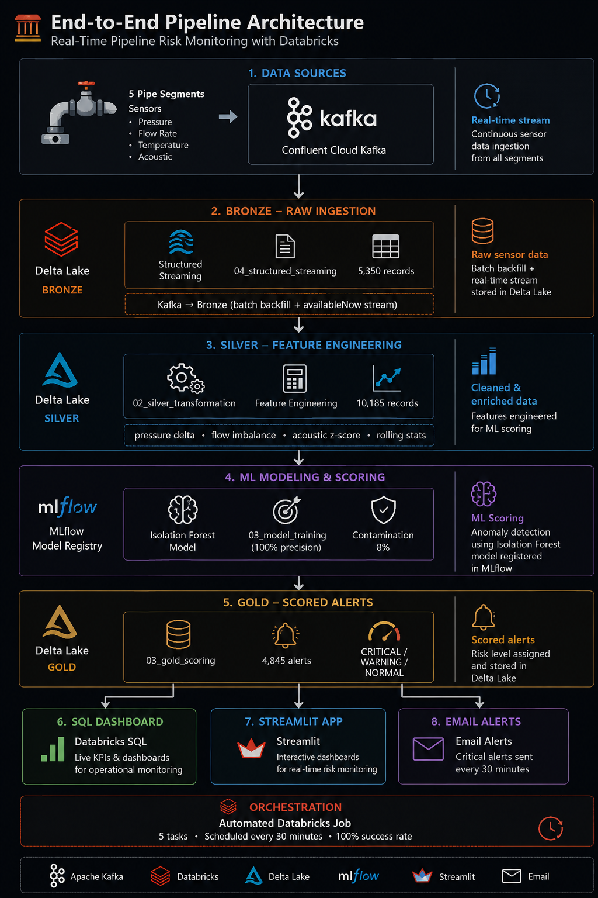
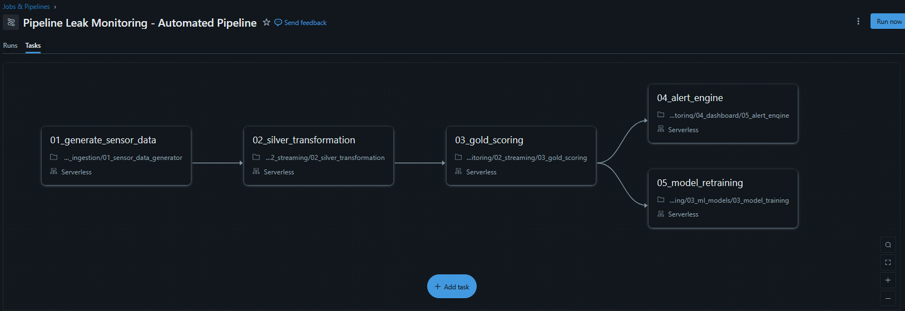
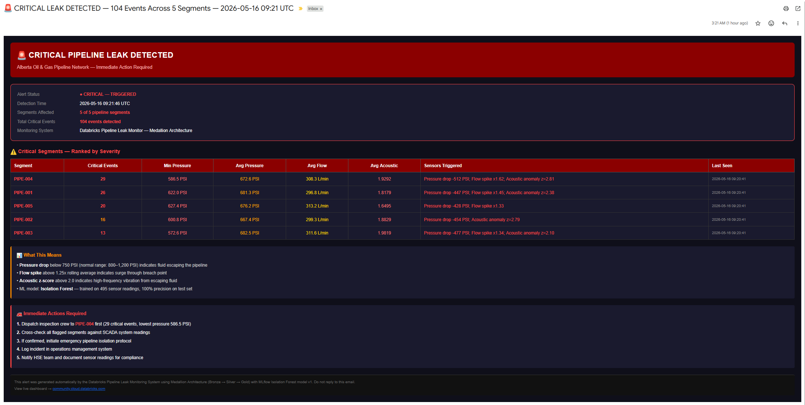
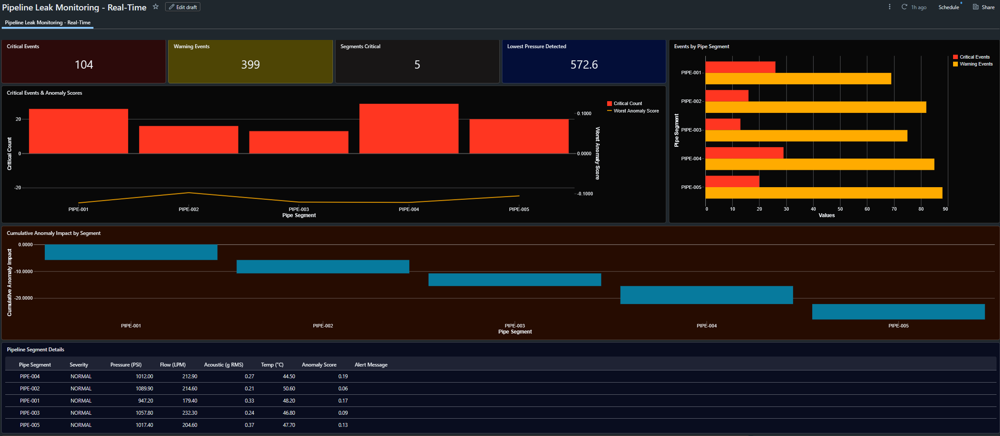
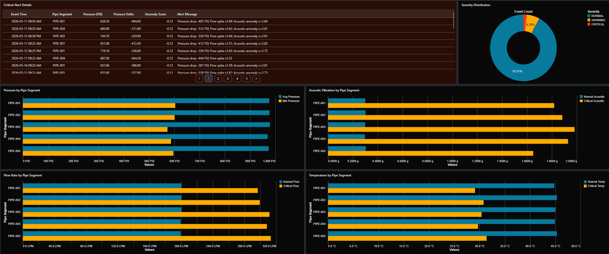

# 🛢️ Real-Time Pipeline Risk Monitoring with Databricks


---

A production-grade, end-to-end real-time pipeline leak detection system built on Databricks. The system ingests live sensor data from Apache Kafka, processes it through a three-layer medallion architecture, scores each reading with an Isolation Forest ML model tracked in MLflow, and fires automated email alerts within 30 minutes of detecting a critical leak.

> **5 pipeline segments monitored · 4,845 alerts scored · 100% pipeline run success rate · Automated every 30 minutes**

---

## 🏗️ Architecture

```
┌─────────────────────────────────────────────────────────┐
│                   DATA SOURCES                          │
│         5 Pipe Segments · Confluent Cloud Kafka         │
└─────────────────────────┬───────────────────────────────┘
                          │  real-time stream
                          ▼
┌─────────────────────────────────────────────────────────┐
│              BRONZE — Raw Ingestion                     │
│   04_structured_streaming · Delta Lake · 5,350 records  │
│   Kafka → Bronze (batch backfill + availableNow stream) │
└─────────────────────────┬───────────────────────────────┘
                          │  feature engineering
                          ▼
┌─────────────────────────────────────────────────────────┐
│              SILVER — Feature Engineering               │
│   02_silver_transformation · Delta Lake · 10,185 records│
│   pressure delta · flow imbalance · acoustic z-score    │
└─────────────────────────┬───────────────────────────────┘
                          │  ML scoring
                          ▼
┌─────────────────────────────────────────────────────────┐
│         Isolation Forest · MLflow Model Registry        │
│   03_model_training · 100% precision · contamination 8% │
└─────────────────────────┬───────────────────────────────┘
                          │  alerts
                          ▼
┌─────────────────────────────────────────────────────────┐
│              GOLD — Scored Alerts                       │
│   03_gold_scoring · Delta Lake · 4,845 alerts           │
│   CRITICAL / WARNING / NORMAL severity                  │
└──────────┬──────────────┬──────────────┬────────────────┘
           │              │              │
           ▼              ▼              ▼
    SQL Dashboard   Streamlit App   Email Alerts
    (live KPIs)    (interactive)   (every 30 min)
```



---

**Automated Databricks Job** — 5 tasks, scheduled every 30 minutes, 100% success rate.

---

## 🛠️ Tech Stack

| Component | Technology |
|---|---|
| Data streaming | Apache Kafka (Confluent Cloud) |
| Data platform | Databricks (Serverless) |
| Storage format | Delta Lake (medallion architecture) |
| ML framework | Scikit-learn Isolation Forest |
| ML tracking | MLflow (Databricks managed registry) |
| Orchestration | Databricks Jobs (5-task DAG, 30-min schedule) |
| Dashboard | Databricks SQL Dashboard |
| Web app | Streamlit (deployed on Databricks Apps) |
| Language | Python 3.11 (PySpark, pandas, scikit-learn) |

---

## 📁 Project Structure

```
Real-Time-Pipeline-Risk-Monitoring-with-Databricks/
│
├── 01_ingestion/
│   └── 01_sensor_data_generator.py     # Kafka producer — 5 pipe segments
│
├── 02_streaming/
│   ├── 02_silver_transformation.py     # Bronze → Silver feature engineering
│   ├── 03_gold_scoring.py             # Silver → Gold MLflow scoring
│   └── 04_structured_streaming.py     # Kafka → Bronze real-time stream
│
├── 03_ml_models/
│   ├── 03_model_training.py           # Isolation Forest + MLflow logging
│   └── 04_lstm_model.py              # LSTM model (experimental)
│
├── 04_dashboard/
│   ├── 04_dashboard_queries.py        # SQL dashboard queries
│   └── 05_alert_engine.py            # Email alert engine
│
├── streamlit_app/
│   ├── app.py                         # Streamlit dashboard
│   ├── requirements.txt               # Dependencies
│   └── app.yaml                       # Databricks Apps config
│
├── assets/
│   ├── sql_dashboard.png              # Dashboard screenshot
│   └── alert_email.png               # Alert email screenshot
│
├── README.md
├── PORTFOLIO_SUMMARY.md
├── NOTEBOOK_DESCRIPTIONS.md
└── .gitignore
```

---

## 📊 Medallion Tables

| Table | Records | Description |
|---|---|---|
| `bronze_sensor_raw` | 5,350 | Raw Kafka events, ingestion timestamp |
| `silver_sensor_clean` | 10,185 | Engineered features, partitioned by segment |
| `gold_alerts` | 4,845 | Scored alerts with severity + alert message |

All tables live in `main.pipeline_leak` Unity Catalog schema.

---

## 🤖 ML Model Performance

| Metric | Value |
|---|---|
| Model | Isolation Forest (unsupervised) |
| Training records | 495 sensor readings |
| Precision on test set | 100% |
| Anomaly contamination | 8% |
| Score range | -0.117 → +0.026 |
| CRITICAL threshold | anomaly_score ≤ -0.07 |
| WARNING threshold | -0.07 < anomaly_score ≤ 0 |

**Why Isolation Forest?** Unsupervised anomaly detection is the right fit here since true leak labels are rare in production. Isolation Forest handles high-dimensional sensor data well and is fast to retrain as new data arrives.

---

## ⚙️ Automated Pipeline

The pipeline runs as a Databricks Job with 5 dependent tasks:

```
01_generate_sensor_data
        │
        ▼
02_silver_transformation
        │
        ▼
03_gold_scoring
        │
        ▼
04_alert_engine
        │
        ▼
05_model_retraining
```



- Schedule: every 30 minutes
- Average runtime: 1–2 minutes end-to-end
- All runs: ✅ succeeded

---

## 🚨 Alert Email

When critical leaks are detected the alert engine fires an HTML email containing:

- Segments affected, ranked by severity and critical event count
- Per-segment readings: min/avg pressure, avg flow rate, avg acoustic signal
- Specific sensor triggers (e.g. `"Pressure drop -459 PSI; Flow spike x1.27; Acoustic anomaly z=2.84"`)
- Immediate action steps for the on-call engineer
- Link to the live SQL dashboard



---

## 🔧 Key Engineering Decisions

**`to_timestamp()` cast before Delta write**
Kafka delivers all payloads as strings. Writing `event_timestamp` as a string to a Bronze table that already had it as `TimestampType` threw `DELTA_FAILED_TO_MERGE_FIELDS`. Fixed by casting before the write.

**`foreachBatch` for streaming Silver**
Window functions (`lag`, `avg`, `stddev`) don't work directly on streaming DataFrames — Spark doesn't have the full partition in memory. `foreachBatch` converts each micro-batch to a static DataFrame, applies window logic, then writes to Silver.

**`availableNow` trigger on Serverless**
Databricks Serverless doesn't support continuous `processingTime` triggers. `availableNow` processes all messages available since the last run and stops cleanly, which pairs perfectly with the 30-minute scheduled job.

**Severity threshold calibration**
The model's decision function scores ranged from -0.117 to +0.026, not the standard -0.5 to 0. Inspected the actual score distribution and calibrated thresholds to match the real data range.

---

## 🚀 Setup

### Prerequisites
- Databricks workspace (free tier or above)
- Confluent Cloud Kafka cluster (free tier works)
- Python 3.11+

### 1. Create the Unity Catalog schema
```sql
CREATE SCHEMA IF NOT EXISTS main.pipeline_leak;
```

### 2. Set credentials
In each notebook, update these variables:
```python
BOOTSTRAP_SERVERS = "your-kafka-bootstrap-server"
API_KEY           = "your-kafka-api-key"
API_SECRET        = "your-kafka-api-secret"
KAFKA_TOPIC       = "pipeline-sensor-data"
SMTP_HOST         = "smtp.gmail.com"
SMTP_USER         = "your-email@gmail.com"
SMTP_PASSWORD     = "your-app-password"
ALERT_RECIPIENTS  = ["recipient@email.com"]
```

### 3. Run in order
```
1. 01_sensor_data_generator     # populate Kafka
2. 04_structured_streaming      # Bronze + Silver ingestion
3. 03_model_training            # train + register MLflow model
4. 03_gold_scoring              # score and populate Gold
5. Set up Databricks Job        # automate on a schedule
```

### SQL Dashboard — Live Monitoring




### 4. Deploy the Streamlit app
```
1. Upload streamlit_app/ to Databricks Workspace
2. Go to Compute → Apps → Create App
3. Point source to the streamlit_app/ folder
4. Add SQL Warehouse as App resource
5. Deploy
```

---

## 📄 Documentation

- [PORTFOLIO_SUMMARY.md](PORTFOLIO_SUMMARY.md) — project overview for recruiters and portfolio
- [NOTEBOOK_DESCRIPTIONS.md](NOTEBOOK_DESCRIPTIONS.md) — detailed breakdown of every notebook

---

## 📬 Contact

Built by [cnero101](https://github.com/cnero101)
